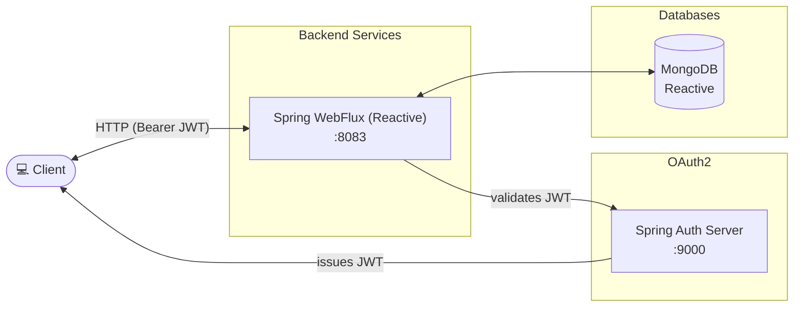

# spring-6-reactive-mongo

Examples of Reactive Programming with Spring Framework.

## Architecture Overview



## Getting started

Server runs on port 8083. Requires the auth server running on port 9000.
There are three profiles:
* default profile: expects a MongoDB installed and running on port 27017
* docker-with-compose: is using the MongoDB created with docker-compose running on port 27018
* docker-with-testcontainer: is using the MongoDB provided by testcontainer/docker running on random port

TODO: currently the docker container is created for all profiles. we should avoid that

Then we have a second profile which starts the mongo-db with the testContainer feature which use docker. the exposed port is changing at each start.
You can find the part in the spring boot startup log or via the "docker ps" command

In Unit Test we are using the TestContainer within Docker which requires Docker Desktop installed. In that case the port does change with each test.

## Urls

- openapi api-docs: http://localhost:8083/v3/api-docs or http://localhost:30083/v3/api-docs
- openapi gui: http://localhost:8083/swagger-ui/index.html or http://localhost:30083/swagger-ui/index.html
- openapi-yaml: http://localhost:8083/v3/api-docs.yaml or http://localhost:30083/v3/api-docs.yaml

## Docker

### create image

```shell
.\mvnw clean package spring-boot:build-image
```

or just run

```shell
.\mvnw clean install
```

### run image

Hint: remove the daemon flag -d to see what is happening, else it run in background

```shell
docker run --name mongo -d -e MONGO_INITDB_ROOT_USERNAME=root -e MONGO_INITDB_ROOT_PASSWORD=secret -p 27017:27017 mongo 
docker stop mongo
docker rm mongo
docker start mongo
docker logs mongo

docker run --name reactive-mongo -d -p 8083:8080 -e SPRING_SECURITY_OAUTH2_RESOURCESERVER_JWT_ISSUER_URI=http://auth-server:9000 -e SERVER_PORT=8080 -e SPRING_DATA_MONGODB_URI=mongodb://mongo:27017/sfg -e SPRING_DATA_MONGODB_USERNAME=root -e SPRING_DATA_MONGODB_PASSWORD=secret --link auth-server:auth-server --link mongo:mongo spring-6-reactive-mongo:0.0.1-SNAPSHOT
 
docker stop reactive-mongo
docker rm reactive-mongo
docker start reactive-mongo
docker logs reactive-mongo
```

## Deployment with Kubernetes

Deployment goes into the default namespace.

To run maven filtering for destination target/k8s

```bash
mvn clean install -DskipTests 
```

To deploy all resources:

```bash
kubectl apply -f target/k8s/
```

To remove all resources:

```bash
kubectl delete -f target/k8s/
```

Check

```bash
kubectl get deployments -o wide
kubectl get pods -o wide
```

You can use the actuator rest call to verify via port 30083

## Deployment with Helm

To run maven filtering for destination target/helm run:

```bash
mvn clean install -DskipTests 
```

Be aware that we are using a different namespace here (not default).

Go to the directory where the tgz file has been created after 'mvn install'

```powershell
cd target/helm/repo
```

unpack

```powershell
$file = Get-ChildItem -Filter spring-6-reactive-mongo-chart-*.tgz | Select-Object -First 1
tar -xvf $file.Name
```

install

```powershell
$APPLICATION_NAME = Get-ChildItem -Directory | Where-Object { $_.LastWriteTime -ge $file.LastWriteTime } | Select-Object -ExpandProperty Name
helm upgrade --install $APPLICATION_NAME ./$APPLICATION_NAME --namespace spring-6-reactive-mongo --create-namespace --wait --timeout 5m --debug --render-subchart-notes
```

show logs and show event

```powershell
kubectl get pods -n spring-6-reactive-mongo
```

replace $POD with pods from the command above

```powershell
kubectl logs $POD -n spring-6-reactive-mongo --all-containers
```

Show Details and Event

$POD_NAME can be: spring-6-reactive-mongo-mongodb, spring-6-reactive-mongo

```powershell
kubectl describe pod $POD_NAME -n spring-6-reactive-mongo
```

Show Endpoints

```powershell
kubectl get endpoints -n spring-6-reactive-mongo
```

status

```powershell
helm status $APPLICATION_NAME --namespace spring-6-reactive-mongot
```

test

```powershell
helm test $APPLICATION_NAME --namespace spring-6-reactive-mongo --logs
```

uninstall

```powershell
helm uninstall $APPLICATION_NAME --namespace spring-6-reactive-mongo
```

delete all

```powershell
kubectl delete all --all -n spring-6-reactive-mongo
```

create busybox sidecar

```powershell
kubectl run busybox-test --rm -it --image=busybox:1.36 --namespace=spring-6-reactive-mongo --command -- sh
```

You can use the actuator rest call to verify via port 30083

## Sandbox (local dev environment)

The sandbox consists of the app (Spring Boot, port 8083) plus an auth-server (port 9000) and MongoDB,
provided by `compose.yaml`. The services start automatically via `spring.docker.compose.enabled=true`
when the app boots, so usually one step is enough.

### Start the sandbox (opencode-sandbox-kit)

The sandbox is provisioned by the opencode-sandbox-kit and runs as a Docker container. It mounts this
repo, starts opencode, and connects the IntelliJ MCP server.

Allow the kit source (GitHub without cloning):

```powershell
sbx settings set kit.allowedSources --% "[\"docker.io/\",\"github.com/dboeckli/\"]"
```

Start a new sandbox:

```powershell
sbx run opencode --name spring-6-reactive-mongo --kit "git+https://github.com/dboeckli/opencode-sandbox-kit.git#dir=opencode-agent" "C:\development\projects\spring-6-reactive-mongo"
```

Start the sandbox with Kubernetes support:

```powershell
sbx run opencode --name spring-6-reactive-mongo --kit "git+https://github.com/dboeckli/opencode-sandbox-kit.git#dir=opencode-agent" "C:\development\projects\spring-6-reactive-mongo" "$env:USERPROFILE\.kube:ro"
```

Apply the kit to an existing sandbox (restarts the sandbox, VM state is kept):

```powershell
sbx kit add spring-6-reactive-mongo "git+https://github.com/dboeckli/opencode-sandbox-kit.git#dir=opencode-agent"
```

### Start the app

```shell
docker compose -f compose.yaml up        # optional: start MongoDB + auth-server manually (else they start with the app)
```

Then run the `Spring6ReactiveMongoApplication` run configuration in IntelliJ
(`.run/Docker with compose Spring6ReactiveMongoApplication.run.xml`). Alternatively start via
`./mvnw spring-boot:run`.

The compose file brings up:

- `auth-server` (port 9000) — required by the OAuth2 resource server
- `mongodb` (port 27018) — required by the reactive data layer

### Verify

